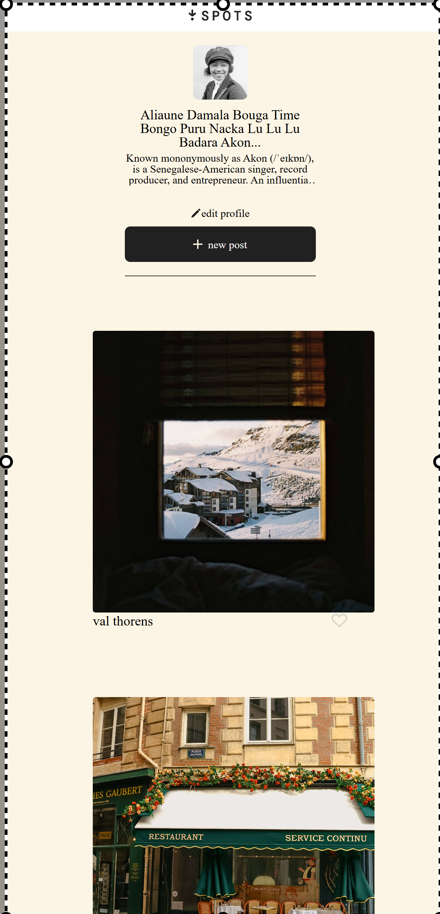
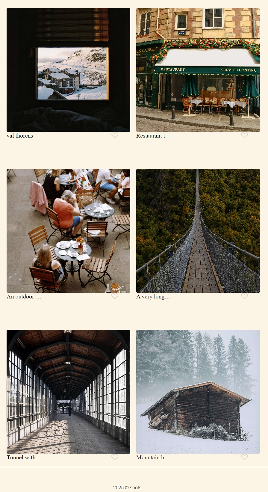

## Project Name: Project Spot ##

Description:
Project Spot is a web-site designed to provide a clean and user-friendly interface for users to manage and update their profiles. The project includes essential features like an editable profile section, options to add new posts, and a well-structured layout for displaying content effectively.

Functionality:

Header and Footer: Provides navigation and branding consistency across pages.
Content Body: Displays user profiles and posts.
Edit Profile Button: Allows users to edit their profile details through an intuitive interface.
Add Profile Button: Enables users to create new profiles or posts.
Grid and Card Layouts: Utilized to present information in a structured and visually appealing manner.
Technologies Used:

HTML: For structuring the content of the web pages.
CSS: For styling the application and enhancing the visual design.

CSS Grid: Used for creating a responsive and adaptable layout.
Card Design: show the images of pictures.

## Screenshot / Demo GIF
video: https://drive.google.com/file/d/13_0zgu2w2NGjgztBgSkmJ9RKxirqZaFX/view?usp=sharing

**Live Demo**: https://userprofilemanager2.netlify.app (or https://tony34x.github.io/se_project_spots/)

## Screenshot / Demo GIF
! Record editing profile or adding post -->

## Setup Instructions
1. Clone repo
2. Open index.html or run build if Webpack needed

## Challenges & Learning
- Dynamic profile editing with JS
- Grid/card layout for posts
- Form handling for edits/adds

 ## Project Pitch Video
 
 Check out [this video](https://drive.google.com/file/d/1f0lB7WEeYaEOMbIBpuQp4MMZ0eE-nGPg/view?usp=sharing), where I describe my 
 project and some challenges I faced while building it.

 [deployed project:]
https://tony34x.github.io/se_project_spots/
