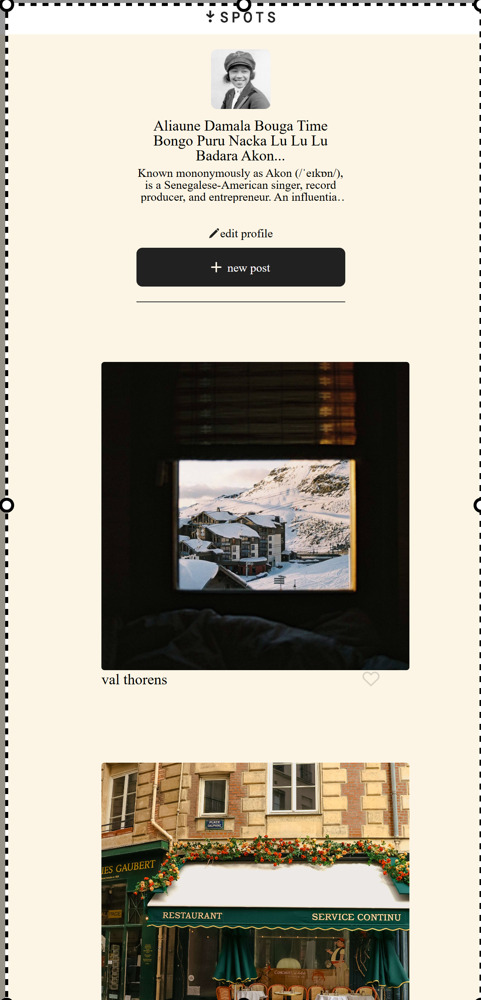

##Project Name: Project Spot##

Description:
Project Spot is a web-site designed to provide a clean and user-friendly interface for users to manage and update their profiles. The project includes essential features like an editable profile section, options to add new posts, and a well-structured layout for displaying content effectively.

Functionality:

Header and Footer: Provides navigation and branding consistency across pages.
Content Body: Displays user profiles and posts.
Edit Profile Button: Allows users to edit their profile details through an intuitive interface.
Add Profile Button: Enables users to create new profiles or posts.
Grid and Card Layouts: Utilized to present information in a structured and visually appealing manner.
Technologies Used:

HTML: For structuring the content of the web pages.
CSS: For styling the application and enhancing the visual design.

CSS Grid: Used for creating a responsive and adaptable layout.
Card Design: show the images of pictures.

 deployed project:
https://github.com/tony34x/se_project_spots